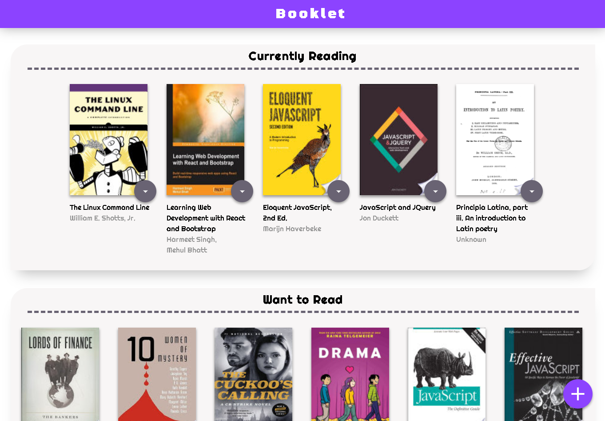
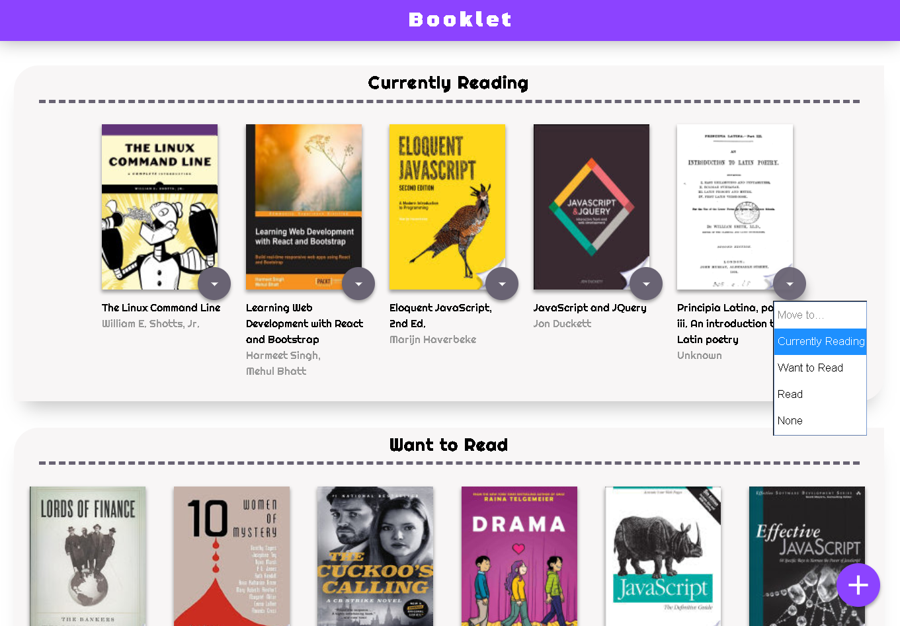
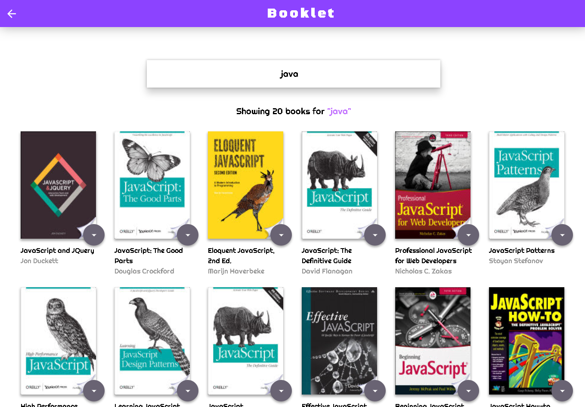
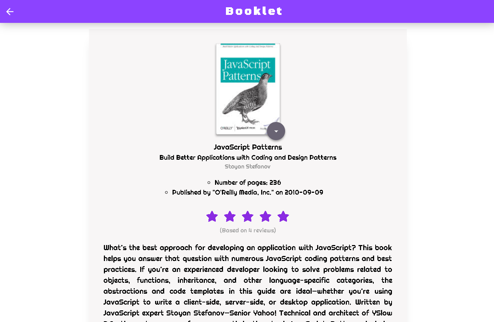

# MyReads Project

## Project Overview

The goal of this project is to create a bookshelf app in React that allows users to select and categorize books they have read, are currently reading, or want to read. The project emphasizes using React to build the application and provides an API server and client library that is required to persist the app information.

## App Functionality

In this application, the main page displays a list of "shelves" (i.e. categories), each of which contains a number of books. The three shelves are:

* Currently Reading
* Want to Read
* Read

Each book has a control that lets you select the shelf for that book. When you select a different shelf, the book moves there.

The main page also has a link to `/search`, a search page that allows to find books to add to the library.

The search page has a text input that may be used to find books. As the value of the text input changes, the books that match that query are displayed on the page, along with a control that lets users to add the book to their library.

The search page also has a link to / (the root URL), which leads back to the main page.

When user navigates back to the main page from the search page, he/she should instantly see all of the selections made on the search page in his/her library.

Also, clicking on the each book item navigates the user into the details page, where the detailed book information is displayed.

## Important

The backend API uses a fixed set of cached search results and is limited to a particular set of search terms, which can be found in [SEARCH_TERMS.md](SEARCH_TERMS.md). That list of terms are the _only_ terms that will work with the backend, so don't be surprised if your searches for Basket Weaving or Bubble Wrap don't come back with any results.

## Installation

To run this app you will have to have [**Node.js**](https://nodejs.org/en/) and [**npm**](https://www.npmjs.com/get-npm) installed in your machine.

Please follow below instructions to run the project in your machine:

1. Clone repository to your local disk
2. Open terminal and navigate to the project folder
3. Run `npm install` command from terminal to install all npm dependencies
4. Run `npm start` command to compile project and run a **dev version** of the application
